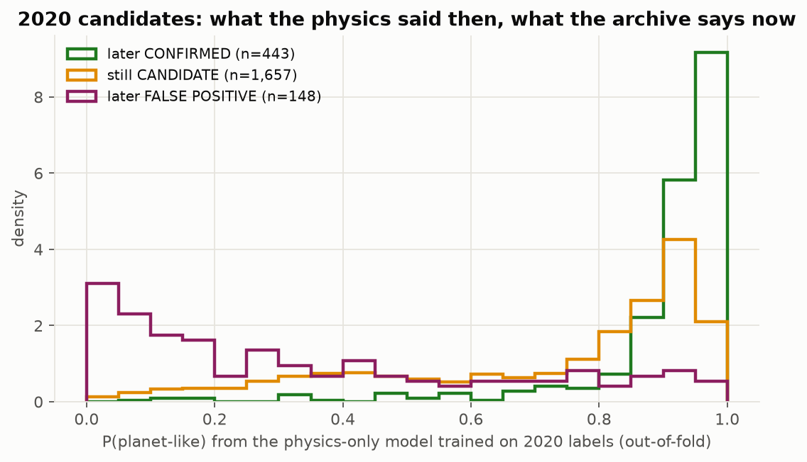

# Kepler exoplanets — KOIs, honest models, and the habitable zone

Analysis of the NASA Exoplanet Archive's **Kepler Objects of Interest (KOI) cumulative table**: what the archive decided about 9,564 transit signals, how far the *physics alone* can predict those verdicts, and which confirmed planets sit in their star's habitable zone. Started as a 2020 Columbia Engineering data-analytics bootcamp project; restarted in 2026 with modern tooling and corrected science.

## ▶ Run the app

**In your browser, nothing to install:** **[rander417.github.io/KeplerExoplanet](https://rander417.github.io/KeplerExoplanet/)**

The app runs entirely on your machine — Python compiled to WebAssembly ([stlite](https://github.com/whitphx/stlite)) served as static files from this repository, so there is no server, no account, and nothing downloaded to disk. The first visit fetches about 30 MB and takes around a minute; later visits are faster.

**On Windows, from a clone:** double-click `run_app.cmd` (needs [uv](https://docs.astral.sh/uv/); the first run builds the environment). Or, from any terminal: `uv run streamlit run app/app.py`.

Five tabs: **Catalogue** (filter, plot, download), **KOI explorer** (one object, the model's calibrated probabilities, what-if sliders), **Habitable zone** (Kopparapu limits with the small confirmed planets and candidates), **Model & honesty** (leakage, calibration, the out-of-time test), **About** (provenance).

**Slides:** [`reports/presentation/Kepler_Refresh_2026.pdf`](reports/presentation/Kepler_Refresh_2026.pdf) (15 slides, the refresh next to the 2020 claims); the 2020 deck sits beside it.



## What we found (2026 refresh)

All numbers come from notebooks or scripts in this repository; the research log entries linked below hold the details.

- **Target leakage settled by the data itself.** The four `koi_fpflag_*` vetting flags are written by the same process that produces the verdict. Between the 2020 snapshot and the live table pulled on 2026-08-25, **925 verdicts (9.7%) changed, and the flags were rewritten with them**. A model that uses the flags scores macro f1 **0.90** on today's labels; the same model on physics alone scores **0.747 ± 0.012** (5-fold CV). The flags "know" the answer; the physics has to earn it. — [notebook 08 log](notes/Research%20Log/2026-08-25%20Notebook%2008%20—%20live%20archive%20vs%20snapshot.md)
- **Physics carries real, forward-looking signal.** The physics-only model trained on the **2020 labels only** rated the 2020 candidates that were *later confirmed* far more planet-like (median 0.95) than those *later dismissed* (median 0.26): **AUC 0.937** on verdicts it never saw. That is the honest answer to the 2020 question "can future observers use our models?".
- **The 2020 numbers, re-labelled.** The "83 / 90 / 90 f1" of 2020 were accuracy and weighted f1; macro f1 was 0.77 / 0.87 / 0.87, and about 0.15 of it came from the flags. The physics-only ceiling is about 0.72–0.75 macro f1 in every construction we tried (tuned boosting, all rows, nested cross-validation). — [notebook 03 log](notes/Research%20Log/2026-08-24%20Notebook%2003%20rewrite%20—%20honest%20baseline.md), [notebook 07 log](notes/Research%20Log/2026-08-24%20Notebook%2007%20—%20models%20v2%20and%20the%20live-data%20fetcher.md)
- **Habitable zone, done on insolation.** With the stellar-temperature-dependent limits of [Kopparapu et al. 2014](https://arxiv.org/abs/1404.5292) and the [Rogers 2015](https://arxiv.org/abs/1407.4457) rocky-radius ceiling, **16 confirmed planets ≤ 2 R⊕ sit in the conservative zone** on today's table (9 of them ≤ 1.6 R⊕), most of them around stars cooler than the Sun. The 2020 list (period, stellar temperature, radius and metallicity — never the planet's insolation) shares none of them. — [notebook 05 log](notes/Research%20Log/2026-08-24%20Notebook%2005%20rebuild%20—%20insolation%20habitable%20zone.md)
- **Clustering is a null result.** Scaled k-means on the physics finds structure that does not track the verdicts (ARI ≤ 0.05), recorded as such. — [notebook 02 log](notes/Research%20Log/2026-08-24%20Notebook%2002%20rewrite%20—%20clustering%20null%20result.md)

## How the app stays honest

- Every KOI's probability in the catalogue is **out-of-fold**: it comes from a model that never saw that KOI's label.
- The model is trained on **today's labels**, uses **twelve physical columns only** (no flags, no `koi_score`), and its probabilities are **calibrated** (isotonic maps fit on out-of-fold scores).
- Labels are decided by an **explicit rule** shown in the app — `P(planet-like) = P(CANDIDATE) + P(CONFIRMED)`, threshold 0.5 — not a hidden argmax.
- The trained model is exported as plain numbers (`app/model/hgb_physics_only.json`) and evaluated with numpy; a test proves the export reproduces scikit-learn's probabilities exactly. That is what lets the same model run in a browser.
- `uv run python -m kepler.app_bundle` regenerates everything the app shows from the tracked data files.

## Repository layout

```
app/          the Streamlit app, its data/model bundle, the stlite page for GitHub Pages
data/raw/     the 2020 Kaggle snapshot and dated live pulls (with provenance JSON)  → data/README.md
notebooks/    01 cleaning & EDA · 02 clustering · 03 baselines · 04 neural net (2020, to be rebuilt) ·
              05 habitable zone · 07 models v2 · 08 live vs snapshot
src/kepler/   the package: data, preprocess, models, clustering, habitable, fetch, portable, verdict, viz
tests/        pytest suite (41 tests)
notes/        Obsidian vault: roadmap, decisions, research log, glossary, references  → notes/00_Index.md
reports/      figures and tables produced by the notebooks; the 2020 presentation
archive/      the 2020 Flask app, database schema, keras-tuner output, and the 2020 README
```

Setup and working agreements: [`CLAUDE.md`](CLAUDE.md). Plan: [`notes/Roadmap.md`](notes/Roadmap.md).

## Getting started

```
uv sync --group dev          # Python 3.12 + everything, from uv.lock
uv run pytest                # 41 tests
uv run jupyter lab           # the notebooks run top to bottom
uv run python -m kepler.fetch          # a fresh pull of the KOI table (writes data/raw/cumulative_tap_<date>.csv)
uv run python -m kepler.app_bundle     # rebuild the app's data and model from the latest pull
```

## Data and references

- NASA Exoplanet Archive, [KOI cumulative table](https://exoplanetarchive.ipac.caltech.edu/docs/API_kepcandidate_columns.html) (column definitions), pulled via the [TAP service](https://exoplanetarchive.ipac.caltech.edu/docs/TAP/usingTAP.html) on 2026-08-25; the 2020-era [Kaggle snapshot](https://www.kaggle.com/nasa/kepler-exoplanet-search-results) is kept for reproducibility. Provenance and column dictionary: [`data/README.md`](data/README.md).
- Kopparapu, R. K., et al. 2014, *ApJL* 787, L29 — [arXiv:1404.5292](https://arxiv.org/abs/1404.5292): habitable-zone insolation limits as a function of stellar effective temperature.
- Rogers, L. A. 2015, *ApJ* 801, 41 — [arXiv:1407.4457](https://arxiv.org/abs/1407.4457): "the majority of 1.6 Earth-radius planets are too low density to be comprised of Fe and silicates alone".
- Full list with notes: [`notes/References/References.md`](notes/References/References.md).

## Credits

2020 team (Columbia Engineering data-analytics bootcamp): Rich Anderson (ML pipeline), Damien Corr, Priscilla Lin, Tom Greff. The original project is preserved at tag `v1-bootcamp-2020` and its README in [`archive/README_2020.md`](archive/README_2020.md). 2026 refresh: Rich Anderson with Claude (Cowork and Claude Code).

*This is an educational analysis of public data, not a product of NASA or the Exoplanet Archive. Verdicts are the archive's; probabilities are ours.*
